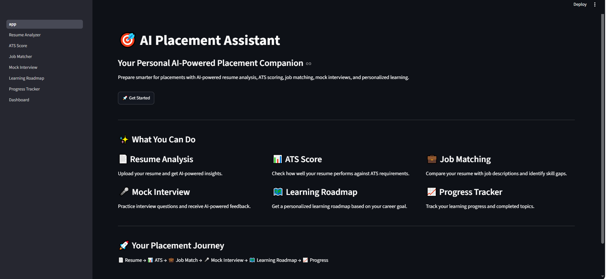
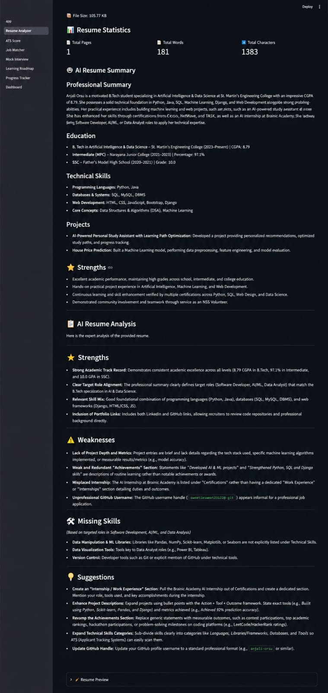
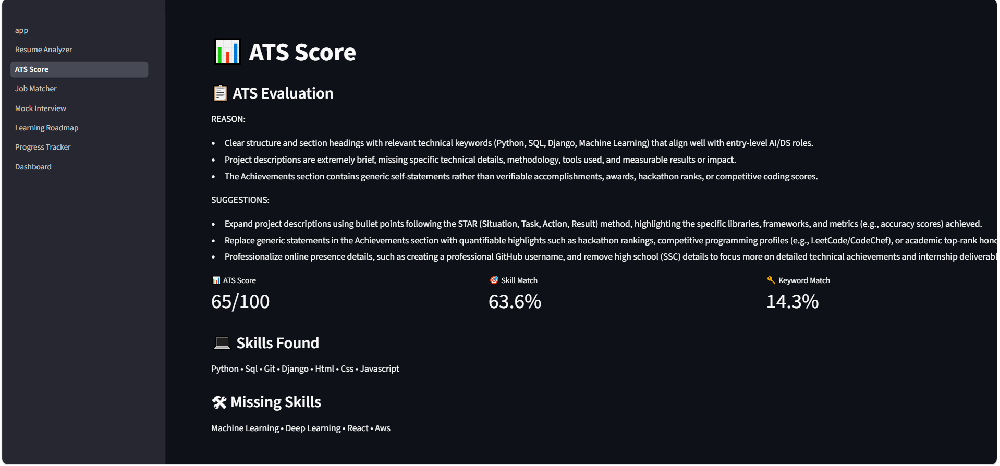
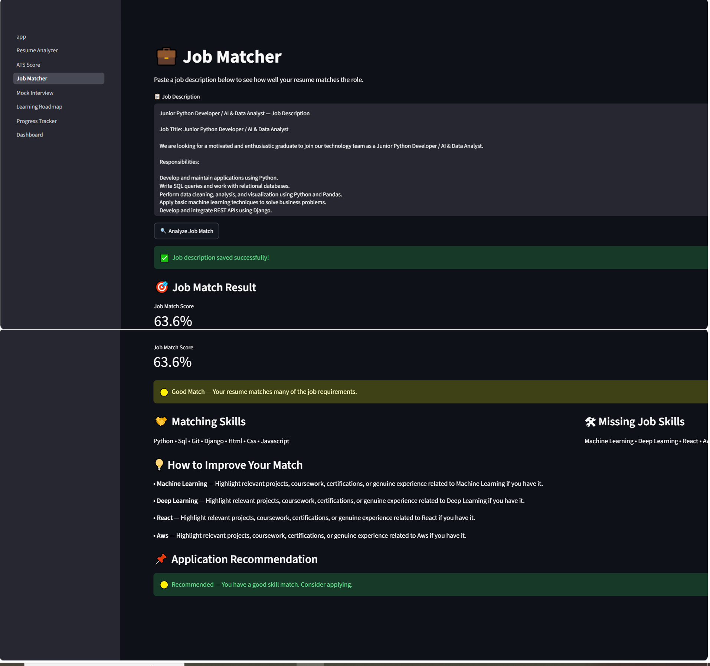
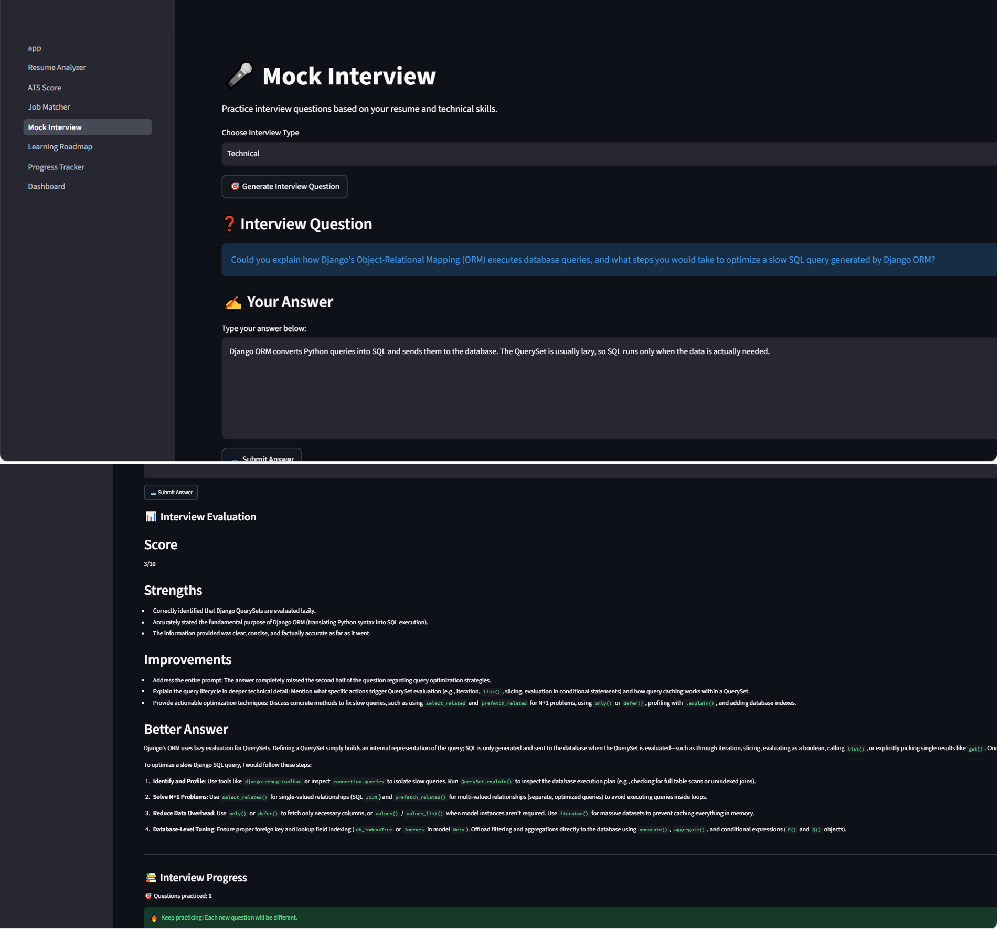
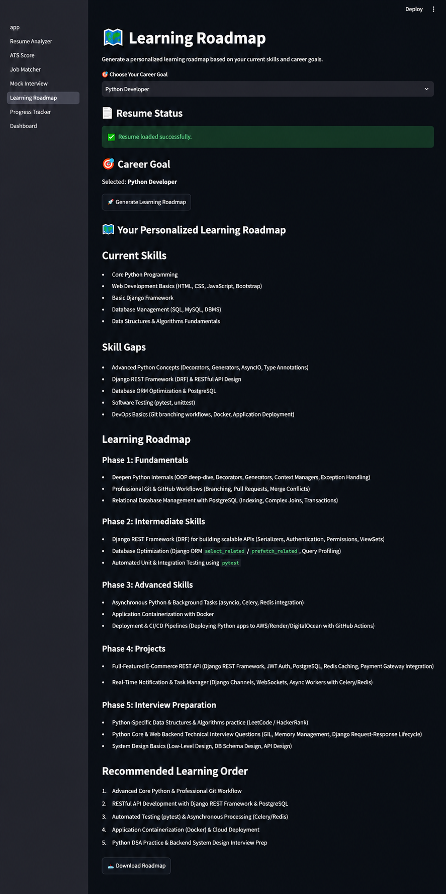
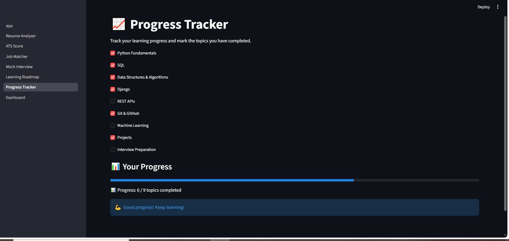
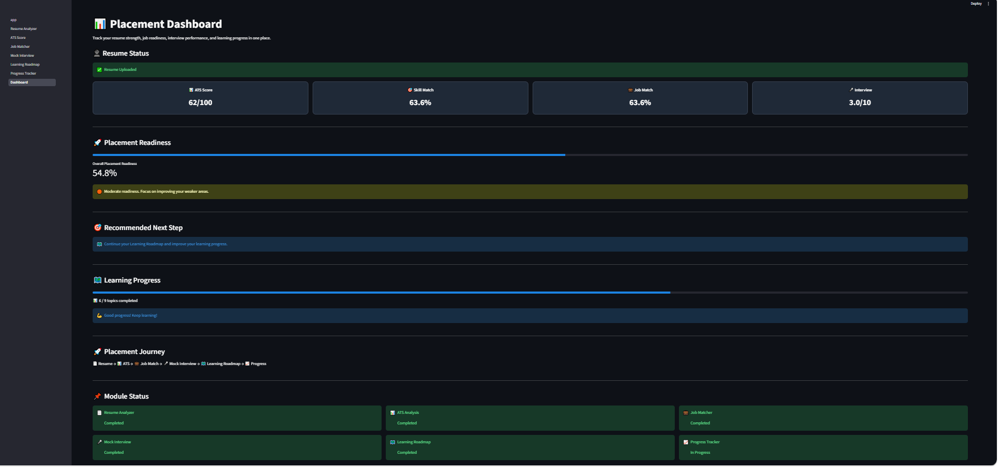

# 🎯 AI Placement Assistant

An AI-powered placement preparation platform designed to help students improve their placement readiness through resume analysis, ATS evaluation, job matching, mock interviews, personalized learning roadmaps, and progress tracking.

## ✨ Features

### 📄 Resume Analyzer

* Upload resumes in PDF format
* Extract resume content automatically using PyMuPDF
* Generate AI-powered resume insights
* Analyze resume content and provide useful feedback

### 📊 ATS Score

* Analyze resume ATS compatibility
* Generate an ATS score
* Identify relevant skills and keywords
* Detect areas that can be improved
* Provide actionable resume suggestions

### 💼 Job Matcher

* Paste a job description
* Compare resume skills with job requirements
* Identify matching skills
* Detect missing job skills
* Calculate job match percentage
* Provide recommendations for improving job compatibility

### 🎤 AI Mock Interview

* Generate interview questions using AI
* Supports Technical, HR, and Project-Based interviews
* Submit answers for AI evaluation
* Receive an interview score
* Identify strengths and improvement areas
* Generate better-answer suggestions
* Prevent repeated questions during the interview session

### 🗺️ Learning Roadmap

* Generate a personalized learning roadmap
* Select a desired career goal
* Identify current skills and skill gaps
* Organize important placement preparation topics
* Recommend a structured learning order

### 📈 Progress Tracker

* Mark learning topics as completed
* Track overall learning progress
* Monitor completed and remaining topics
* Display learning progress on the Dashboard

### 📊 Placement Dashboard

* View ATS score
* View job match score
* View skill match
* View mock interview performance
* Calculate overall placement readiness
* Get recommended next steps
* Monitor learning progress

## 🛠️ Tech Stack

* Python
* Streamlit
* Google Gemini API
* PyMuPDF
* Pandas
* Python-dotenv
* Git & GitHub

## 🏗️ Project Structure

```text
AI-Placement-Assistant/
│
├── app.py
├── requirements.txt
├── README.md
├── .gitignore
│
├── pages/
│   ├── 1_Resume_Analyzer.py
│   ├── 2_ATS_Score.py
│   ├── 3_Job_Matcher.py
│   ├── 4_Mock_Interview.py
│   ├── 5_Learning_Roadmap.py
│   ├── 6_Progress_Tracker.py
│   └── Dashboard.py
│
└── screenshots/
    ├── welcome.png
    ├── resume_analyzer.jpeg
    ├── ats_score.png
    ├── job_matcher.png
    ├── mock_interview.png
    ├── learning_roadmap.png
    ├── progress_tracker.png
    └── dashboard.png
```

## ⚙️ Installation & Setup

### 1. Clone the repository

```bash
git clone https://github.com/orsuanjali2346/AI-Placement-Assistant.git
```

### 2. Navigate to the project directory

```bash
cd AI-Placement-Assistant
```

### 3. Create a virtual environment

```bash
python -m venv venv
```

### 4. Activate the virtual environment

**Windows:**

```bash
venv\Scripts\activate
```

### 5. Install dependencies

```bash
pip install -r requirements.txt
```

### 6. Configure the Gemini API

Create a `.env` file in the project root:

```text
GEMINI_API_KEY=your_api_key_here
```

Do not upload your `.env` file or API key to GitHub.

### 7. Run the application

```bash
streamlit run app.py
```

The application will open in your browser.

## 📸 Screenshots

### 🏠 Welcome Page



### 📄 Resume Analyzer



### 📊 ATS Score



### 💼 Job Matcher



### 🎤 Mock Interview



### 🗺️ Learning Roadmap



### 📈 Progress Tracker



### 📊 Placement Dashboard



## 🔐 Security

* API keys are stored using environment variables.
* Sensitive configuration files such as `.env` are excluded using `.gitignore`.
* API credentials should never be committed to the repository.

## 🚀 Future Enhancements

* Voice-based mock interviews
* Resume improvement suggestions with downloadable output
* More advanced job recommendation features
* Additional career-specific learning roadmaps
* Deployment with a production database
* User authentication and profile management

## 👩‍💻 Author

**ORSU ANJALI**

B.Tech Student

GitHub: https://github.com/orsuanjali2346

LinkedIn: https://linkedin.com/in/anjaliorsu

## 📌 Project Repository

GitHub Repository:

https://github.com/orsuanjali2346/AI-Placement-Assistant
